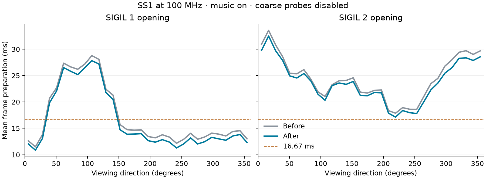

**Doom wall batching and deferred plane steps — SS1, 2026-09-13**

The wall and floor/ceiling changes produce another **0.9–3.1% FPS** in the
stationary SIGIL tests and **2.0–2.5%** during recorded gameplay. Mean frame
preparation falls by 0.56–0.75 ms. This is a useful incremental improvement;
it does not reach the proposed 2–3 ms saving or another 10% overall.

The baseline includes the complete
[previous CPU optimization pass](SS1_DOOM_OPTIMIZATION_20260913.md).
Both sides use the same SS1 and counter-equipped core at 100 MHz, Direct FB,
a 320×168 gameplay viewport plus HUD, and music enabled. Coarse renderer
probes are disabled for the comparisons below; the RAM recorder, GPU counters
and MIDI timing remain enabled. The normal release application is built and
tested separately. These measurements are not uninstrumented executable FPS
or whole-episode averages.

| Workload | Before FPS | After FPS | Gain | Mean preparation before → after |
| --- | ---: | ---: | ---: | ---: |
| SIGIL 1 opening, stationary rotation | 53.899 | 54.358 | 0.9% | 16.172 → 15.440 ms |
| SIGIL 2 opening, stationary rotation | 38.724 | 39.923 | 3.1% | 23.935 → 23.184 ms |
| SIGIL 1 DEMO1, E3M2 in the compatibility WAD | 38.934 | 39.726 | 2.0% | 22.121 → 21.558 ms |
| SIGIL 2 DEMO1, E6M1 | 32.534 | 33.358 | 2.5% | 24.104 → 23.441 ms |

Rotation captures last 30 seconds after warmup, with monsters disabled.
Gameplay captures play the WAD's recorded DEMO1 with its own game settings
and monsters, recording approximately simulation tics 175–1225. This avoids
including different sections of the demo because of level-loading time.
The initial demo captures using a wall-clock warmup were excluded, including
one interrupted collector that read a later run's result. They do not
contribute to the table or the exported accepted captures.

At shared simulation tics, player X/Y/Z, angle, health and episode/map match
exactly: **869 matching tics for SIGIL 1 and 751 for SIGIL 2**, with no
mismatches. Interpolated view positions need not match between frames because
the two builds render at different times. There is one final capture per
side and workload; the results are not confidence intervals.

The p95 preparation times improve from 27.651 to 26.834 ms and from 31.152
to 30.152 ms in the two rotation tests. During the demos they improve from
37.472 to 36.559 ms and from 46.026 to 45.719 ms. Heavy views still exceed
the 16.67 ms frame budget, so missed refresh deadlines remain.

A separate SIGIL 2 demo comparison enables coarse renderer probes on both
sides. It includes substantial masked rendering and produces the following
mean elapsed times:

| Stage | Before | After |
| --- | ---: | ---: |
| BSP and walls | 16.420 ms | 15.712 ms |
| Floors and ceilings | 3.366 ms | 3.347 ms |
| Masked rendering | 4.465 ms | 4.441 ms |
| Frame preparation | 26.323 ms | 25.540 ms |

Most of the observed saving comes from wall processing. The plane change's
effect on total plane time is small in this workload, and there is no measured
masked-stage regression here. The coarse pair matches player state at 708
shared simulation tics. These timings include interrupt time and overlap
with the separately measured MIDI handler time; they must not be added to it.

The production implementation changes four files in the sibling Doom
repository:

- [r_segs.c](../../Doom/src/doom/cdoom/doom/r_segs.c) collects already clipped
  opaque columns into a fixed 320-entry buffer. Clipping no longer calls the
  GPU producer for every column. Final scale stepping retains the exact
  32-bit result, and plane coverage and sprite clipping retain their order.
- [r_gpu.c](../../Doom/src/doom/cdoom/doom/r_gpu.c) and
  [r_gpu.h](../../Doom/src/doom/cdoom/doom/r_gpu.h) add the batch producer.
  It calculates the light row once per X position and processes upper/lower
  tiers in the original order. The producer retains band selection, capacity
  checks and flush ordering. The existing scalar API remains for masked and
  fallback work. No GPU command format or FPGA change is required.
- [r_plane.c](../../Doom/src/doom/cdoom/doom/r_plane.c) defers X/Y texture-step
  calculation until a span needs the fallback path. A per-row validity byte
  lets GPU and fallback spans share the distance cache without reusing stale
  steps after a height or frame change.

The compact clipping loop and batch producer use **14,152 of 14,336 bytes**
of application fast RAM, leaving **184 bytes free** on MiSTer and Pocket.
That is 72 bytes less fast-RAM use than the baseline. Ordinary BSS increases
by 2,752 bytes, including the column buffer and row-validity flags. The scalar
wall producer moves to ordinary text; the moving and detailed rendering
comparisons cover its interaction with masked rendering. Arbitrary WADs and
all fallback-heavy scenes have not been exhaustively profiled.

Validation passes against the preserved starting source:

| Check | Evidence |
| --- | --- |
| Actual clipping and wall-loop state | 12,000 cases; 39,228,820 identical bytes, covering 108,412 GPU columns and 34,475 fallback columns |
| Actual GPU band producers | 1,746,437 columns, 89,975,483 pixels and 41,746 flushes; identical records, order and counters |
| Mixed GPU/fallback plane mapping | 262,144 calls; 185,088 accepted parameter spans and 85,760 fallback emissions; 11,962,368 identical bytes |
| GPU parameter setup | 300,000 cases with identical parameter bytes |
| Existing renderer/audio regression suite | All 24 checks pass |
| Normal MiSTer and Pocket builds | Both build without warnings or errors |

The focused comparisons use address and undefined-behavior sanitizers. The
plane fixture resets through production frame setup, then varies both step
signs directly to avoid the baseline host `FixedDiv` negative-left-shift
operation; it does not change the production fixed-point helper. Final source
cleanup was checked to leave the normal executables' code, data, fast-RAM
sections and BSS allocation identical to the tested implementation before
cleanup. Music logic is unchanged, and accepted hardware captures record no
MIDI envelope-budget overruns. Audio was not recorded or assessed by listening.

The normal MiSTer build passed the E1M1 save, Doom OPTIONS/HUD restoration,
MiSTer OSD navigation and invulnerability rendering smoke checks. The
[menu observations and screenshots](measurements/ss1-next-20260913/menu-observations.md)
record what was verified. The SS1 was returned to MENU and its installed
core, Doom executable, boot ROM and save disk retain their original hashes;
see the [restoration check](measurements/ss1-next-20260913/restore-check.txt).

Normal artifacts are [MiSTer app.elf](../../Doom/build/ss1-next-20260913/normal-mister/app.elf)
and [Pocket app.elf](../../Doom/build/ss1-next-20260913/normal-pocket/app.elf).
Pocket performance has not been measured on hardware. The existing 100 MHz
experimental core remains in use; this software pass does not change or close
its previously reported negative setup slack.

The [measurement archive](measurements/ss1-next-20260913/) contains **10 accepted
captures and 11,783 frames**, compressed
CSV captures, summaries, run metadata, trajectory comparisons, production and
diagnostic patches, test logs and build hashes. Its scripts preserve the
local benchmark environment and require the private build trees and SS1 data.
The [artifact manifest](measurements/ss1-next-20260913/artifacts.json) records
the exact executable and FPGA identities.
