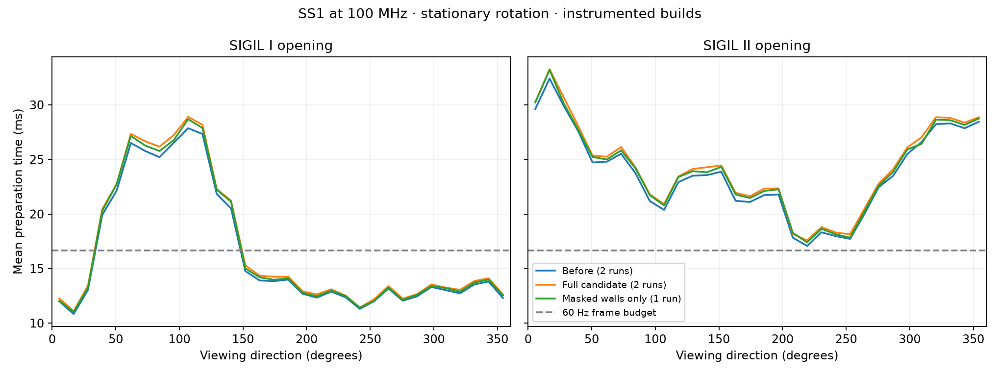

**Doom masked rendering and GPU write-pipeline experiments — SS1, 2026-09-13**

This pass did not produce another Doom speedup worth enabling. The masked
rendering candidates were reverted because they slowed the SIGIL opening
scenes. The optional GPU pipeline remains disabled on both targets: it
improves component throughput, but gives negligible Doom FPS gains, and one
instrumented hardware run hung. The previous wall-batching and plane
optimizations remain intact. No clock, version, installed runtime or release
was changed.

The baseline is the completed [wall-batching pass](SS1_DOOM_BATCHING_20260913.md).
Both retained normal executables were rebuilt and match that pass's SHA-256
hashes exactly. The new masked-rendering regression tools remain available;
the rejected implementations are archived as patches.

All performance captures use the SS1 at 100 MHz, Direct FB, a 320×168 gameplay
viewport plus HUD, and music. The software comparisons use the same
counter-equipped core. Coarse renderer probes are disabled unless stated;
the RAM recorder, GPU counters and MIDI timing remain enabled. These are
instrumented measurements, not normal-executable FPS or episode averages.

Moving captures play each WAD's DEMO1 with its recorded game settings and
monsters, covering approximately simulation tics 175–1225. Opening captures
rotate in place with monsters disabled for 30 seconds after warmup. The full
candidate and baseline have two captures per workload. The table averages
the per-run measurements; these are not confidence intervals.

| Workload | Before FPS | Full candidate FPS | Change | Preparation before → candidate |
| --- | ---: | ---: | ---: | ---: |
| SIGIL I opening rotation | 54.248 | 53.922 | −0.60% | 15.439 → 15.750 ms |
| SIGIL II opening rotation | 39.923 | 38.997 | −2.32% | 23.132 → 23.702 ms |
| SIGIL I DEMO1, compatibility WAD E3M2 | 39.744 | 39.827 | +0.21% | 21.551 → 21.462 ms |
| SIGIL II DEMO1, E6M1 | 33.376 | 33.552 | +0.53% | 23.425 → 23.279 ms |

The full candidate walked accepted masked-wall and affine-sprite posts
straight into GPU records, checking bounds and light rows once per column.
It also deferred masked-wall reciprocals until fallback rendering and skipped
masked ranges whose columns had all been consumed. Partially consumed ranges
kept their original projection endpoints. Output equivalence passed, but the
opening-scene regressions outweighed the small moving-demo gains.

Restricting the new path to masked walls also regressed both openings:
**53.945 FPS in SIGIL I and 39.326 FPS in SIGIL II**, versus 54.248 and 39.923.
Preparation rose to 15.618 and 23.492 ms. These narrower-variant results have
one capture per opening; its remaining moving/coarse tests were cancelled
once both openings regressed. The exact cause of the CPU regression was not
isolated. The sprite fast path alone does not explain it.

A separate coarse-probe SIGIL II demo pair reduced the full candidate's
masked stage from 4.440 to 4.212 ms. This local improvement did not predict
whole-frame performance across scenes. A sprite-clipping bitmap experiment
then increased that stage to 4.330 ms and was also rejected. Stage timings
include interrupt time and overlap the independently measured MIDI handler;
they must not be added as disjoint CPU costs.

The retained renderer files match the starting source byte for byte. Normal
MiSTer and Pocket builds still use **14,152 / 14,336 bytes** of application
fast RAM, leaving 184 bytes. Their ELF files are 1,291,784 bytes. No SDK ABI,
GPU command format, music logic or gameplay rule changed.

The optional RTL experiment overlaps the write combiner's next RAM lookup
with its current merge. Explicit forwarding handles same-entry collisions,
including different address tags hashing to the same entry. It uses the
existing two M10Ks and retains output-queue and fence ordering.

| GPU-only workload | Previous cycles | Pipelined cycles | Reduction |
| --- | ---: | ---: | ---: |
| Quiet memory model, 394 cases | 1,465,848 | 1,384,583 | 5.54% |
| Delayed memory model, 394 cases | 2,374,086 | 2,314,362 | 2.52% |

These are component cycle measurements. SS1 comparisons with the same Doom
executable reduced GPU busy time but produced negligible FPS changes. CPU
BSP/wall work remained the largest measured stage, around 15.7 ms in the
coarse SIGIL II demo. GPU stall counters overlap and cannot be added or
converted directly into FPS. The next substantial improvement needs to
address CPU renderer preparation; these experiments do not establish a
further 10% saving.

`GPU_WRITE_COMBINE_PIPE` defaults to zero, and neither normal target overrides
it. Both final default configurations retain the baseline simulated cycle
totals above. The opt-in implementation and forwarding regressions are
preserved for further investigation; they are not enabled in normal builds.

A normal, non-counter experimental MiSTer build with the pipeline enabled
passes all twenty setup, hold, recovery, removal and pulse-width checks at
100 MHz: worst setup **+0.040 ns**, worst hold **+0.111 ns**. It uses seed 1,
28,564 ALMs, 412 RAM blocks and 58 DSP blocks. The seed 3, 6 and 9 placements
missed setup by 0.296, 0.448 and 0.395 ns respectively. The successful build
is preserved as an experimental artifact; it has not been tested on hardware.
The retained normal core and its seed settings were not replaced with it.

An earlier ungated normal prototype also passed all twenty timing checks
(+0.074 ns setup, +0.081 ns hold). The counter-equipped prototype used for
pipeline measurements missed setup by 0.462 ns. One SIGIL II launch with
that instrumented core failed to return a capture or screenshot and left
MiSTer unable to process MENU commands. Restarting the MiSTer process did
not recover the device; a reboot returned it to MENU. Its cause is unresolved,
and no samples from that run are accepted. Positive timing on a different
build does not establish that this failure is fixed.

Seven Pocket placements with the pipeline enabled were tested: seeds 1, 3,
6, 9, 12, 15 and 21. Worst setup ranged from −0.828 to −1.670 ns, worse than
the previous Pocket image's −0.540 ns. A fresh fit with the pipeline disabled
used 15,395 ALMs and 297 RAM blocks, with −0.645 ns setup. Pocket remains at
the requested 100 MHz and is not timing-clean. Its existing core can remain
in use. This experiment did not establish a Pocket ALM or hardware FPS gain.

Validation results:

| Check | Evidence |
| --- | --- |
| Full and wall-only post producers | Each matches 490,541 GPU posts, 19,577,526 pixels, 56,402 flushes and 364,243 fallback posts across 1,966,080 input columns |
| Actual masked range renderer | 96,000 visits; 1,501,727 GPU posts and 914,872 CPU posts match; identical projection inputs and consumed columns |
| Opaque wall records | 1,746,437 columns and 41,746 flushes match |
| Existing renderer/audio regressions | All 24 checks pass |
| Combiner protocol, both settings | Three randomized seeds per setting, over 1.5 million accepted writes; masks, aliases, backpressure, flush and reset pass |
| Continuous combiner streams | 1,024 writes in 1,024 cycles when pipelined, versus 2,047 cycles serialized |
| GPU acceptance | Pocket 276/276; MiSTer 299/299, including the final default MiSTer configuration |
| GPU queue/reset comparisons | 788 cases per mode and 256 resets per target configuration; pixel and consumed-arithmetic comparisons pass |
| Full SDRAM contention | Both optional-pipeline and default runs pass 183 translucent frames with no pixel failures or invalid frames; truecolor blend differential passes |

Focused software tests use address and undefined-behavior sanitizers. The
candidate uses defined 32-bit wrapping for post arithmetic; its comparison
uses `-fwrapv` to model RV32 at extreme scales. The rejected clipping bitmap
also passed 24,000 complete sprite walks. The SDRAM rig's diagnostic tap was
updated from removed skid-register names to the actual read-FIFO overflow.
The model reports a refresh gap across its explicit controller recovery reset
before the soak; the pixel verdict is not a warning-free SDRAM protocol
sign-off.

The [measurement archive](measurements/ss1-masked-20260913/) contains **36
accepted captures and 42,337 frames**, compressed CSVs, metadata, trajectory
comparisons, source hashes, candidate patches and test/timing reports.
Player state matches at shared simulation tics in the accepted comparisons.
The [artifact manifest](measurements/ss1-masked-20260913/artifacts.json) records
exact executable and core identities. Incomplete or cancelled runs are listed
separately. A scratch-directory cleanup interrupted an earlier matrix; the
recovered diagnostic executables reproduced their original hashes before
measurements resumed.

Retained normal executables are [MiSTer](../build/ss1-masked-20260913/artifacts/doom-mister.elf)
and [Pocket](../build/ss1-masked-20260913/artifacts/doom-pocket.elf). They are the
previous optimized version, not a new performance release. Audio has not been
recorded or assessed by listening, and Pocket hardware FPS was not measured.

The retained normal Doom and previous normal core passed the recovery smoke
check: E1M1 save loading, Doom OPTIONS and HUD restoration, OSD input routing
and navigation, and invulnerability rendering. The [observations and
screenshots](measurements/ss1-masked-20260913/menu-observations.md) describe
what was verified. This was a short smoke test, not long-duration validation
of the experimental pipeline.

The SS1 was returned to MENU. Its installed core, Doom executable, boot ROM
and original save disk retain their initial hashes; see the [restoration
check](measurements/ss1-masked-20260913/restore-check.txt). The temporary SSH
password helper was removed. No commit or release was made.
