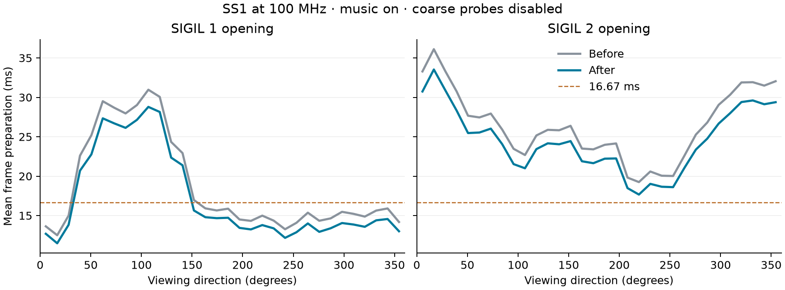

**Doom CPU and GPU submission optimization — SS1, 2026-09-13**

This pass improves the controlled SIGIL 1 opening benchmark by **2.8% FPS**
and SIGIL 2 by **7.8% FPS**. Average frame preparation falls by approximately
7%, saving 1.20 ms and 1.93 ms respectively. The requested additional 10%
has not been reached. Normal MiSTer and Pocket application builds are complete.

Both sides use the same already optimized, counter-equipped FPGA core at
100 MHz. “Before” is the Doom software at the start of this pass, so these
figures are additional to the core improvements measured in the
[previous report](SS1_DOOM_PROFILE_20260913.md).

| Scene | Before FPS | After FPS | FPS gain | Mean preparation before → after | p95 preparation before → after |
| --- | ---: | ---: | ---: | ---: | ---: |
| SIGIL 1 opening | 52.470 | 53.932 | 2.8% | 17.380 → 16.177 ms | 29.622 → 27.597 ms |
| SIGIL 2 opening | 35.951 | 38.745 | 7.8% | 25.848 → 23.916 ms | 33.581 → 31.113 ms |

The comparisons use `baseline-control-*` and `final2-control-*` captures:
Direct FB, a 320×168 gameplay viewport plus HUD, interpolation and MIDI on,
monsters disabled, and stationary rotation for 30 seconds after five seconds
of warmup. Coarse renderer probes are disabled on both sides; the RAM frame
recorder, GPU counters and MIDI timing remain active. These are controlled
hardware measurements, not uninstrumented release-executable FPS or
whole-episode averages. There is one final control capture per scene and
baseline; this is not a statistical confidence interval.

Each curve averages preparation within 32 equal heading bins. Giving each
bin equal weight yields 18.686 → 17.248 ms for SIGIL 1 and
26.500 → 24.531 ms for SIGIL 2, confirming that the improvement persists
after accounting for the different number of rendered frames per direction.
Several directions still exceed the 16.67 ms budget. Fixed-refresh scanout
turns missed deadlines into longer presentation intervals, so preparation
time and FPS do not change in a simple one-to-one ratio.

The final diagnostic build also runs the user's first-slot E1M1 saved
position at **60.015 FPS**, with 7.727 ms mean preparation, 14.658 ms p95
preparation and no presentation interval over 25 ms in the 30-second
capture. That run has coarse probes enabled and is a validation result,
not an additional before/after comparison.

The production changes are:

- **Exact wall geometry reuse.** Cache each segment's exact distance and
  texture offset for the current view X/Y. Clipped ranges and rotation reuse
  the integer result; movement, level geometry rebuilding and generation
  rollover invalidate it. Lighting, heights and side texture offsets retain
  their existing updates. The RV32 segment cache grows from 56 to 64 bytes,
  adding eight bytes per segment in ordinary RAM.
- **A compact wall loop in fast RAM.** Fully supported opaque GPU walls use
  a smaller loop for clipping, plane coverage and GPU column submission.
  Standard fixed lighting, including invulnerability, qualifies. Masked walls,
  unsupported textures or light rows, and other unsupported cases retain the
  general loop. Fallback texture preparation preserves the previous setup
  order. The hardware column submission helper also runs from fast RAM.
- **Less visplane clearing.** Initialize top columns when a plane's active
  horizontal range expands, including any intervening gap. Reusing a plane
  no longer clears its entire screen-width array before its coverage is known.
- **Less repeated synth arithmetic.** Cache unchanged pitch routing and
  clamped envelope volume inputs; controllers explicitly invalidate affected
  results. All envelope and LFO steps still advance at 1 kHz, and mixer writes
  retain their values and ordering. The two new bytes fit existing voice
  structure padding. Doom opts into placing the envelope tick in fast RAM;
  the general SDK leaves that placement option off by default. The canonical
  SDK implementation and Doom's copy match byte for byte.

Together, fast code and data occupy **14,224 of 14,336 bytes**, leaving
**112 bytes free** in both normal builds. This is 80 bytes less than the
starting application's fast-RAM allocation. These are software placement
changes; this pass changes neither the RTL nor the FPGA clock and makes no
new ALM reduction claim.

MIDI handler CPU duty falls from 12.390% to 10.689% in SIGIL 1 and from
12.095% to 10.710% in SIGIL 2. The final captures have no envelope-budget
overruns. These are measured handler costs, not subjective audio-quality
measurements. No audio recording or listening assessment was performed.

With coarse probes enabled, the renderer breakdown is:

| Stage, mean elapsed ms | SIGIL 1 before | SIGIL 1 after | SIGIL 2 before | SIGIL 2 after |
| --- | ---: | ---: | ---: | ---: |
| BSP and walls | 12.824 | 11.709 | 20.224 | 18.397 |
| Floors and ceilings | 3.833 | 3.719 | 4.009 | 3.963 |
| Masked rendering | 0.913 | 0.888 | 1.712 | 1.655 |

Stage timings include any interrupt time spent inside them. They overlap
MIDI handler time and must not be added to it. Detailed wall probes located
the main cost in wall setup and the column loop. The two early detail runs
using expensive timer system calls were excluded; replacement probes read
the cycle counter directly and are retained for diagnosis, not headline FPS.

Validation compares production functions against the preserved starting
source with address and undefined-behavior sanitizers:

| Check | Result |
| --- | --- |
| Synth, 49,500 envelope ticks at each voice limit | 492,907 / 711,157 / 807,965 identical mixer/state records at 12 / 20 / 28 voices |
| Canonical SDK synth, fast tick enabled | 711,157 identical records at 20 voices |
| Visplane allocation and coverage | 131,072 checks across 1,024 reused frames; 80,493,872 identical trace bytes |
| GPU wall loop and general fallback | 12,000 cases; 108,412 GPU columns and 34,475 fallback columns; 39,228,820 identical trace bytes |
| Existing smoothness suite | All 24 checks pass |
| Existing MIDI scheduler and voice lifetime checks | Pass |
| Normal MiSTer and Pocket builds | Both complete without build warnings or errors |

The synth cases include controllers, sustained notes, stealing, stale
generations and timer wrap. Wall cases cover valid and unsupported fixed
light rows, masked and partially supported walls, clipping, plane coverage
and stepping state. The smoothness suite also checks exact wall math,
view-cache movement/reload/rollover, video pacing, HUD restoration, sprites
and sound effects. Test drivers are in the sibling Doom repository:
[synth](../../Doom/tools/check_smp_voice_equivalence.py),
[visplanes](../../Doom/tools/check_visplane_equivalence.py),
[wall loop](../../Doom/tools/check_gpu_wall_loop.py) and
[smoothness](../../Doom/tools/check_smoothness.py).

The normal MiSTer build passed a short SS1 menu smoke test: Doom OPTIONS
opens and returns to gameplay with the HUD restored; F12 intercepts
navigation while the MiSTer OSD is open; gameplay resumes afterward.
Standard invulnerability lighting also renders correctly through an OSD
open/navigation/close cycle. The screenshots and precise limits of this
check are in the [menu observations](measurements/ss1-opt-20260913/menu-observations.md).
The SS1 was returned to MENU, and hashes verify that its original installed
core, Doom executable, boot ROM and save disk are unchanged. See the
[restoration check](measurements/ss1-opt-20260913/restore-check.txt).

The shared code is built for Pocket, but physical Pocket FPS has not been
measured. The wall cache particularly benefits stationary rotation and
repeated clipped ranges; moving gameplay needs its own measurements.
The general wall fallback now resides in SDRAM, so scenes dominated by
masked or unsupported textures also need hardware performance coverage.
This remains the previously accepted experimental 100 MHz core: the earlier
normal-core timing report has −0.367 ns setup slack and the counter core
−0.263 ns. This software pass does not establish timing closure.

BSP and wall processing remains the largest measured cost, followed by
floor/ceiling setup and MIDI. The next measured optimization pass should
target repeated wall setup and RV32 memory access, with moving-player and
masked-wall cases added to the hardware workload. The small final GPU fence
wait does not support promising another 10% from command DMA alone.

The [measurement archive](measurements/ss1-opt-20260913/) contains 23 accepted
captures totaling **31,216 frames**, compressed CSV traces, run metadata,
summaries, the exact changes from this pass, diagnostic instrumentation,
build hashes and plotting scripts. Captures validate duration, fixed player
position, health, heading coverage and 100 MHz. Helper scripts preserve the
local benchmark setup and require its private build trees and SS1 data;
they are not a standalone benchmark installer.

Normal build artifacts are
[MiSTer app.elf](../../Doom/build/ss1-opt-20260913/release-mister/app.elf) and
[Pocket app.elf](../../Doom/build/ss1-opt-20260913/release-pocket/app.elf).
Their hashes are recorded in the
[artifact manifest](measurements/ss1-opt-20260913/artifacts.json).
