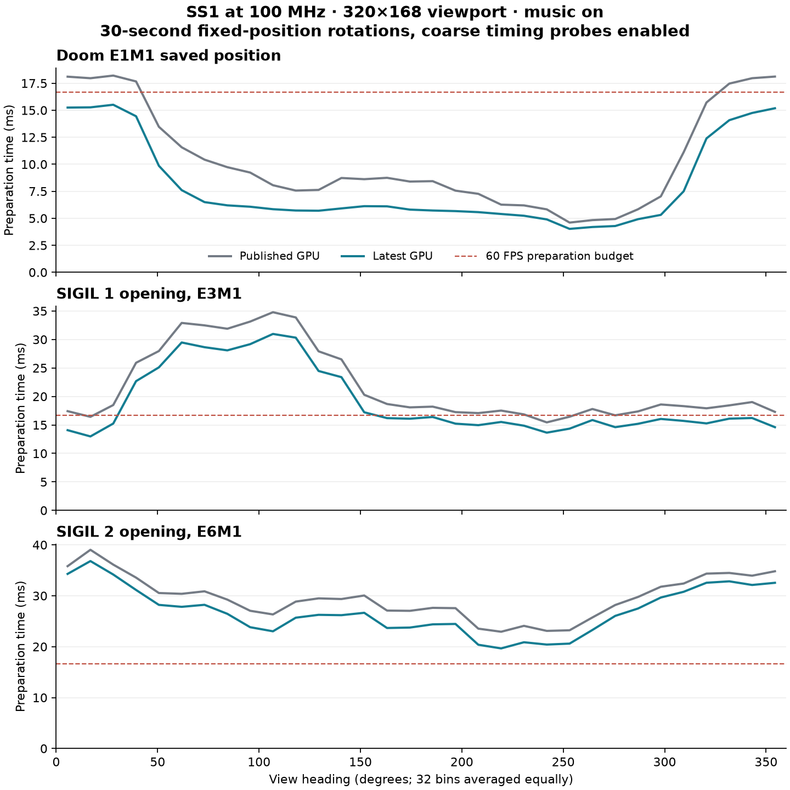
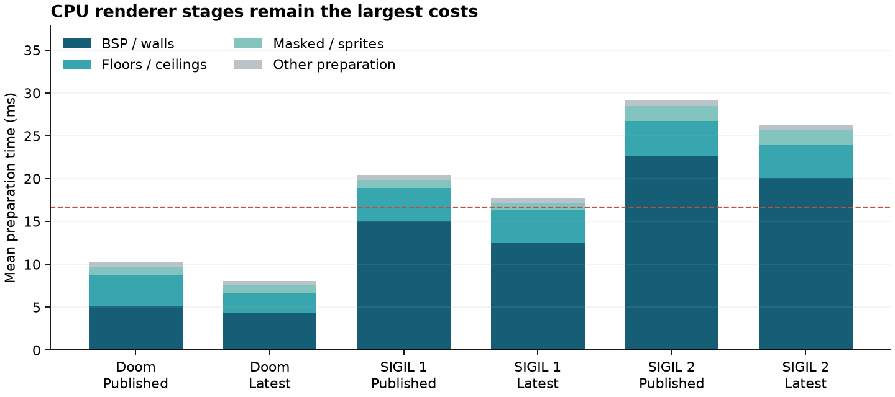

# Doom performance measured on SS1 — 2026-09-13

The current GPU changes improve the controlled SIGIL renderer benchmarks by
**about 12% FPS versus the installed published core**. The remaining costs
point first to **CPU BSP/wall processing and MIDI/envelope work**. Larger GPU
texture caches and command-DMA changes are lower priorities for these scenes.

## Hardware and test scope

SuperStation One at 100 MHz, MiSTer Direct FB default, 320×168 gameplay viewport
plus status bar, interpolation and MIDI music enabled. Each run rotates at a
fixed position for 30 seconds after five seconds of warmup. SIGIL tests have
monsters disabled to keep position and workload repeatable. Doom uses the
user's first-slot E1M1 save. These are controlled renderer benchmarks, not
whole-episode gameplay averages or Pocket measurements.

Twenty accepted captures contain **27,333 frames**, covering approximately
ten minutes of measured operation. Every accepted run checks completion,
constant player position, health, heading coverage and the 100 MHz clock.
Hardware-counter runs independently measure essentially 100.000 MHz.

## Measured improvement

The following uses the **same diagnostic ELF with coarse probes disabled** on
both cores. A lightweight RAM recorder remains active; this is an overhead
control, not a claim that these are unmodified release-executable FPS values.
Both cores run the current Doom source, isolating the core comparison.

| Scene | Published core | Latest core | FPS gain |
| --- | ---: | ---: | ---: |
| SIGIL 1 opening | 47.27 | 52.90 | 11.9% |
| SIGIL 2 opening | 32.67 | 36.36 | 11.3% |

With the coarse probes enabled, Doom's saved position improves from
59.11 to 60.01 FPS.
The latest core stays around 60 FPS throughout that rotation. SIGIL 1 and 2
coarse-probe runs average 52.07 and
35.35 FPS; independent repeats produce
52.07 and 35.39 FPS.

The coarse timing probes add approximately 0.6–0.7 ms of preparation time in
the same-executable controls. The separate counter-equipped FPGA produces
52.04/35.39 FPS,
closely matching the normal latest core with the same app instrumentation.



Some full-size SIGIL directions still exceed 16.67 ms substantially. An average
speedup of another 10% would not make every tested SIGIL 2 direction sustain
60 FPS. Preparation costs and presentation intervals are different measurements;
fixed-refresh scanout quantizes late frames into longer display intervals.

## Where frame time goes

All values below are mean milliseconds per frame, coarse probes enabled.

| Scene | Old prepare | New prepare | New BSP/walls | New planes | New masked | GPU fence wait | DMA polling |
| --- | ---: | ---: | ---: | ---: | ---: | ---: | ---: |
| Doom saved position | 10.27 | 8.08 | 4.26 | 2.44 | 0.81 | 0.050 | 0.068 |
| SIGIL 1 | 20.44 | 17.76 | 12.52 | 3.77 | 0.89 | 0.046 | 0.234 |
| SIGIL 2 | 29.13 | 26.33 | 20.05 | 3.96 | 1.69 | 0.048 | 0.206 |

BSP/walls account for about 71% and 76% of the measured SIGIL preparation
time. These are **inclusive elapsed times**: MIDI interrupts can occur inside
renderer stages. The audio figures below overlap those stages and must not
be added to them. Cache maintenance also nests inside renderer stages. GPU
fence waits describe CPU blocking, not total GPU work; DMA polling includes
timer-read overhead. Preparation excludes pacing and initial buffer acquisition.



## GPU counters

The custom core's counters are passive and disabled in normal builds.

| Counter | SIGIL 1 | SIGIL 2 |
| --- | ---: | ---: |
| GPU busy, % elapsed cycles | 21.59% | 17.26% |
| Fragment-state cycles, % | 13.29% | 12.45% |
| Write-data backpressure, % | 13.16% | 9.90% |
| Combiner input backpressure, % | 4.73% | 5.29% |
| Exposed texture-request backpressure, % | 0.06% | 0.10% |
| Texture requests/frame | 55,444 | 56,030 |
| Texture fills/frame | 805 | 2,043 |
| 32-bit writes/frame | 15,150 | 15,805 |

Texture fill requests are about 1.45%/3.65% of texture requests. Exposed
valid/ready backpressure is not the complete texture-miss penalty: an
outstanding lookup also gates upstream request issue. These results do not
justify treating that one stall counter as total cache cost.

Counter percentages overlap. GPU busy includes queued work and flip waits;
it is not shader utilization. Traffic counters cover the GPU's port only,
excluding CPU, audio and scanout traffic. The low overall GPU duty cycle and
small final CPU fence waits favor CPU optimization first. Within the GPU,
write backpressure is a more evident target than increasing texture capacity.
The improved CPU renderer time after a GPU-only change is consistent with
reduced shared-memory contention; CPU cache-miss counters were not measured.

## Music cost, with matching allocations

A second diagnostic ELF times the MIDI callback. Both sides initialize and
load music normally. The comparison stops playback after one second, retains
the loaded song and bank, and starts measurement after warmup. It does not
use `-nomusic` to change startup allocation. Only matched pairs from this
second ELF are compared here.

| Scene | Music on: prepare | Playback stopped: prepare | Less preparation time | MIDI handler CPU time |
| --- | ---: | ---: | ---: | ---: |
| SIGIL 1 | 18.15 ms | 15.02 ms | 17.2% | 12.4% |
| SIGIL 2 | 26.59 ms | 21.85 ms | 17.8% | 12.1% |

The handler runs about 1,000 times per second. The current service-table timer
API intentionally pins callbacks to 1 kHz; the SDK's requested 50 Hz and its
comment do not describe the observed callback frequency. These runs record
zero envelope-budget overruns. Keeping music's 1 ms envelope resolution while
avoiding repeated voice/pitch/volume calculations is a promising next target.
Stopping music also reduces GPU write backpressure, so its cost includes
shared-memory effects as well as the measured interrupt handler CPU time.
Disabling music is a diagnostic comparison, not a proposed gameplay change.

## Next optimization order

1. **CPU BSP/walls:** split traversal, clipping and wall setup in the next
   focused pass; hoist repeated wall/texture/light calculations and improve
   RV32 code and data placement. This is the largest measured renderer bucket.
2. **MIDI/envelope processing:** approximately 12% CPU duty in both tracks.
   Cache calculations for unchanged voice/channel state while preserving
   envelope steps, event order and audible output. Do not simply lower the
   timer rate or remove music.
3. **Floor/ceiling setup:** roughly 3.8–4.0 ms/frame in SIGIL. Further reuse
   of visplane coefficients and reduced parameter-submission work can help.
4. **GPU writes:** improve combiner throughput, dirty-entry drains and burst
   scheduling. Measure the full game again; GPU-only cycle savings do not
   translate directly into FPS while CPU work dominates.
5. **Lower priority:** larger texture caches and command-DMA overlap.
   Average DMA polling is about 0.2 ms/frame, too small to supply another 10%
   by itself. More detailed miss-latency measurements should precede extra
   texture-cache storage.

A useful next target is **2–3 ms less preparation per heavy frame** from the
wall and audio paths together. That is a target for implementation and
remeasurement, not an unmeasured promised speedup.

## Benchmark setup findings and validation

Command-line `-warp` initializes the level before `I_InitGraphics()` calls
`R_GPU_Init()`. Its initial texture registration can therefore miss the GPU
and fall back to CPU rendering. The harness reloads the map after graphics
initialization. Deferred new game also clears `nomonsters`, so the harness
preserves that flag. Early software-fallback or moved/dead-player runs were
excluded. These setup fixes live in the private diagnostic source; production
Doom source is unchanged. The initialization ordering is a separate bug-fix
candidate, not a speedup counted in the core comparison.

The GPU counter test checks clock and selector readback, reset, a draw with
256 texture requests and exactly 64 physical writes, and exact framebuffer
bytes. The complete MiSTer acceptance run passes **300 checks** with counters
enabled. Reproduce with:

```sh
python3 tools/check_gpu_profile.py --output build/gpu-profile-check
```

The normal MiSTer build was restored after the diagnostic build. Its bitstream
hash exactly matches the measured normal image. The 100 MHz images retain
setup timing violations: normal worst setup **−0.367 ns**, counter image
**−0.263 ns**. Worst hold is positive (**+0.049/+0.075 ns**); all eighteen other
corner checks pass. The timing gate correctly fails; these are experimental
100 MHz measurements, not timing signoff or a long-duration stability result.
Normal/counter images use 28,321/28,806 ALMs, both 412 M10Ks and 58 DSPs.

## Evidence and SS1 restoration

The SS1 is returned to the MiSTer menu. Its installed core, Doom executable,
boot ROM and original save image remain unchanged; see the
[restoration checks](measurements/ss1-20260913/restore-check.txt).
Private test files remain under `/media/fat/.openfpgaOS-profile-20260913`.
The profiling executable writes slots 5–9 of its private save copy and must
not be used with the original save disk. No version, commit or release was made.

- [All summaries](measurements/ss1-20260913/summaries.json) and
  [run metadata / hashes](measurements/ss1-20260913/runs.json).
- [Binary artifact hashes](measurements/ss1-20260913/artifacts.json).
- [Method and counter definitions](measurements/ss1-20260913/method.md).
- [Normal timing](measurements/ss1-20260913/normal-timing.tsv) and
  [diagnostic timing](measurements/ss1-20260913/counter-timing.tsv).
- Raw 64-column frame CSVs are gzip-compressed alongside those files.
  GPU counters are valid only with `gpu_counter_magic=0x53535031`.
  MIDI fields are valid only for format version 2 (`v3-*` captures).
- The v2/v3 source patches, FAT access and run helpers, analyzer and plotter
  accompany the data. They apply to a private copy of this working Doom/SDK
  tree, compiled with `PERF=1` using the existing SDK toolchain. The run helper
  expects an untracked local SSH askpass helper; credentials are not included.
  These helpers preserve the original build-tree paths and inputs; they are
  provenance rather than a standalone benchmark package.
- Full build logs, binaries and private source snapshots remain in
  `build/ss1-profile-20260913` and the sibling Doom directory of the same name.
